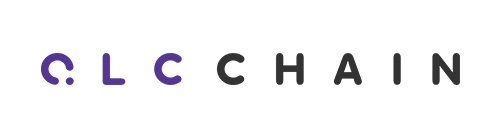

    

---
## What is QLC Chain?

**[English](README.md)** **[中文](README_CN.md)**

---

QLC Chain is a next generation public blockchain designed for the NaaS. It deploys a multidimensional Block Lattice architecture and uses virtual machines (VM) to manage and support integrated Smart Contract functionality. Additionally, QLC Chain utilizes dual consensus: Delegated Proof of Stake (DPoS), and Shannon Consensus, which is a novel consensus developed by the QLC Chain team. Through the use of this dual consensus protocol, QLC Chain is able to deliver a high number of transactions per second (TPS), massive scalability and an inherently decentralized environment for NaaS related decentralized applications (dApp). The framework of QLC Chain will enable everyone to operate network services and benefit from it.

Network-as-a-Service (NaaS) is sometimes listed as a separate cloud provider along with Infrastructure- as-a-Service (IaaS), Platform-as-a-Service (PaaS), and Software-as-a-Service (SaaS).
This factors out networking, firewalls, related security, etc.

NaaS can include flexible and extended Virtual Private Network (VPN), bandwidth on demand, custom routing, multicast protocols, security firewall, intrusion detection and prevention, Wide Area Network (WAN), content addressing and filtering, and antivirus.

---

## Key Features

* Multidimensional Block Lattice Structure 
* QLC Chain Smart Contract 
* Dual Consensus Protocol 

## Links & Resources
* [QLC Website](https://qlcchain.org)
* [Discord Chat](https://discord.gg/JnCnhjr)
* [Reddit](https://www.reddit.com/r/Qlink/)
* [Medium](https://medium.com/qlc-chain)
* [Twitter](https://twitter.com/QLCchain)
* [Telegram](https://t.me/qlinkmobile)
